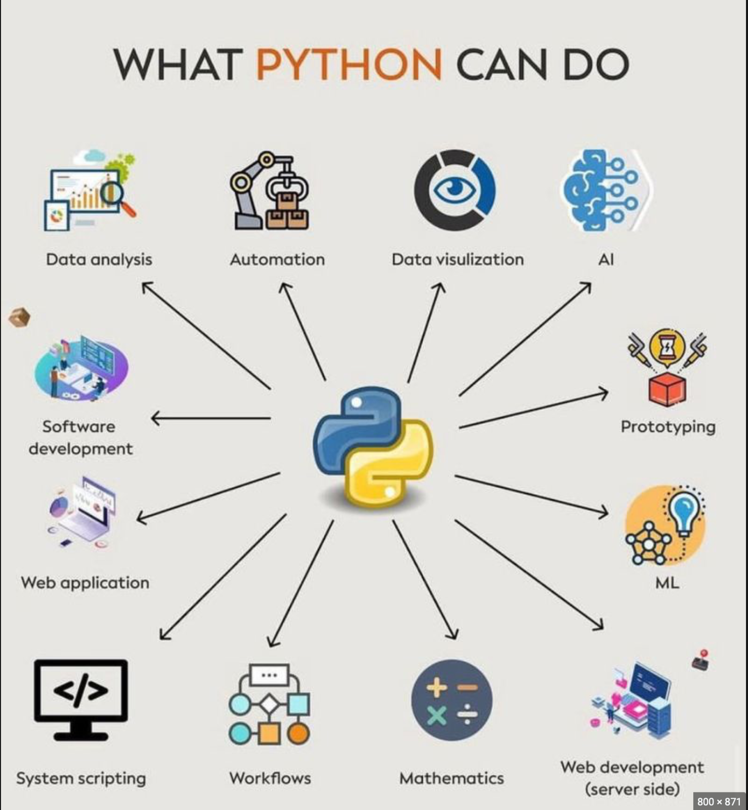
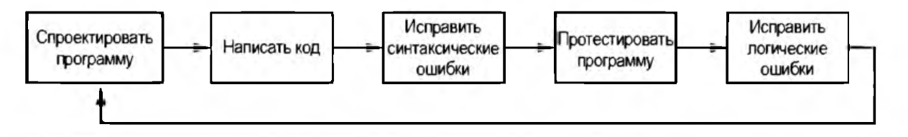
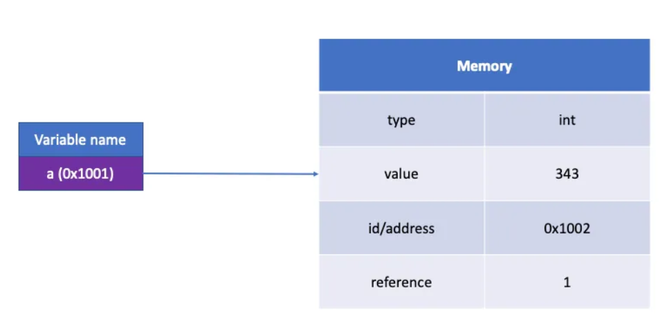
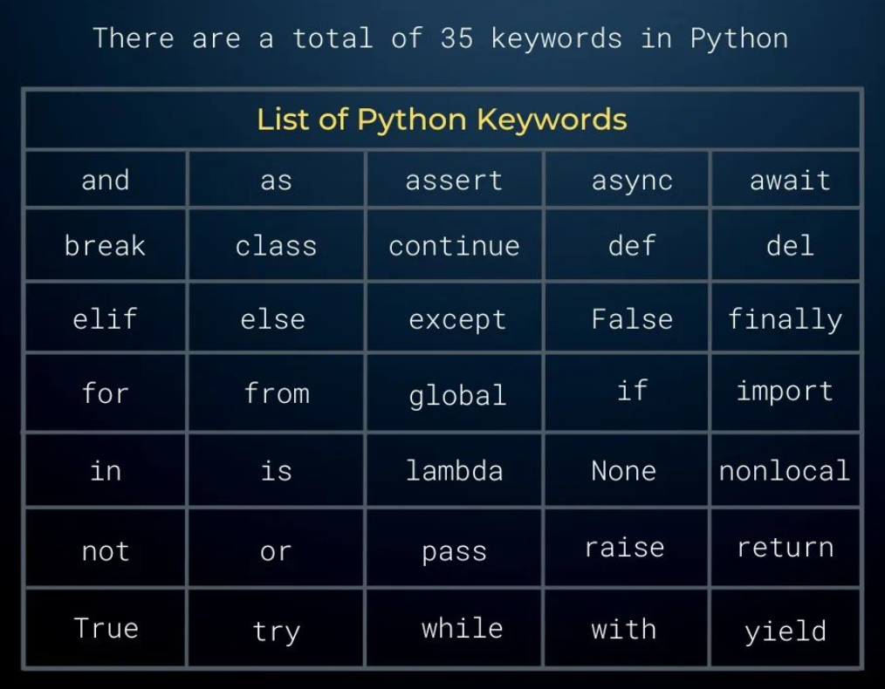
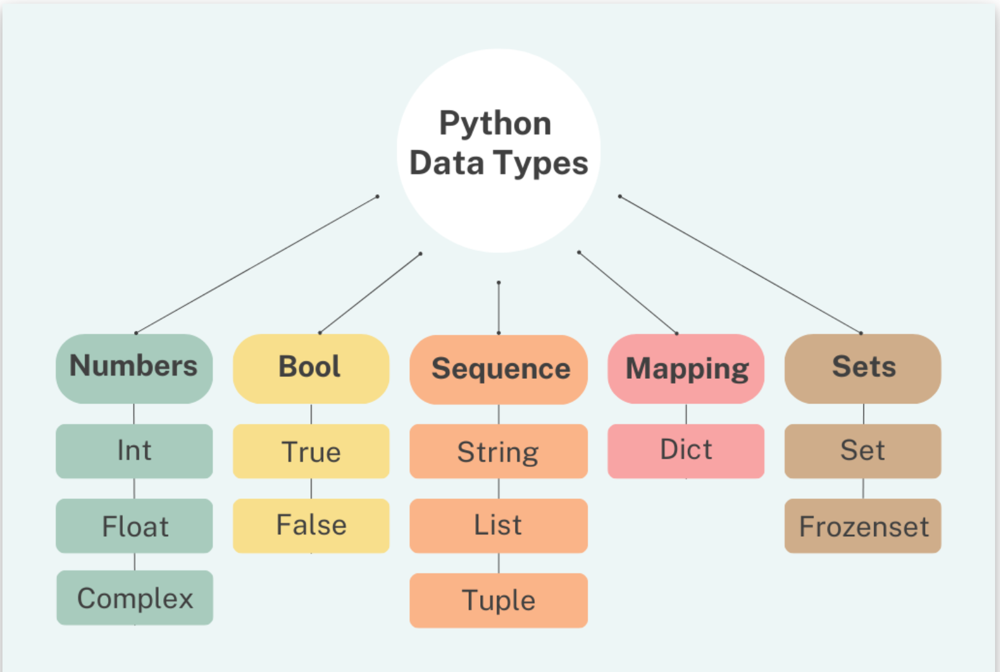

### Введение в программирование на Python

Теперь детальнее: что такое Python? Язык программирования Python — это объектно-ориентированный язык программирования
высокого уровня общего назначения с открытым исходным кодом. Это определение может быть тяжелым для новичков, поэтому
рассмотрим каждую характеристику отдельно, чтобы понять, что она означает:

**Открытый исходный код:** это бесплатно и доступно для дальнейших улучшений, таких как добавление полезных функций или
исправление ошибок.

**Объектно-ориентированный:** основан не на функциях, а на объектах с определенными атрибутами и методами.

**Высокоуровневый:** удобный для человека, а не для компьютера.

**Общее назначение:** можно использовать для создания любых программ.

Он используется в любом программном обеспечении, о котором вы только можете подумать. Вы можете использовать его для
создания веб-сайтов, искусственного интеллекта, серверов, программного обеспечения для бизнеса и многого другого.
Язык применяется в науке о данных, анализе данных, машинном обучении, инженерии данных, веб-разработке, разработке
программного обеспечения и других областях.

## Плюсы и минусы Python

# Плюсы

**1. Его легко читать, учить и писать**

Это язык программирования высокого уровня с английским синтаксисом. Это облегчает чтение и понимание кода.
Его действительно легко понять и изучить, поэтому многие люди рекомендуют Python новичкам. Вам нужно меньше строк
кода для выполнения той же задачи по сравнению с другими основными языками, такими как C/C++ и Java.

**2. Повышает производительность**

Это очень продуктивный язык. Благодаря его простоте, разработчики могут сосредоточиться на решении проблемы. Им не
нужно тратить слишком много времени на понимание синтаксиса или поведение языка программирования. Вы пишете меньше кода
и выполняете больше задач.

**3. Интерпретируемый язык**

Python является интерпретируемым языком, что означает, что он напрямую выполняет код построчно. Если произошла ошибка,
он останавливает дальнейшее выполнение и сообщает о ее возникновении. Он показывает только одну ошибку, даже если в
программе несколько ошибок. Это упрощает отладку.

**4. Динамически типизированный**

Он не определяет тип переменной, пока мы не запустим код. Он автоматически присваивает тип данных, когда происходит
процесс выполнения. Специалист может не беспокоиться об объявлении переменных и их типов данных.

**5. Бесплатный и с открытым исходным кодом**

Этот язык поставляется под одобренной OSI лицензией с открытым исходным кодом. Это делает его бесплатным для
использования и распространения. Вы можете загрузить исходный код, изменить его и даже распространять свою версию. Это
полезно для организаций, которые хотят использовать свою версию для разработки.

**6. Поддержка обширных библиотек**

Стандартная библиотека этого языка огромна, вы можете найти почти все функции, необходимые для вашей задачи. Таким
образом, вам не нужно зависеть от внешних библиотек.

**7. Портативность**

Во многих языках, таких как C/C++, вам нужно изменить свой код, чтобы запустить программу на разных платформах. С
Python все иначе. Вы только пишете один раз и запускаете его где угодно.

# Минусы

**1. Низкая скорость**

Выше мы обсуждали, что — это интерпретируемый язык с динамической типизацией. Построчное выполнение кода часто приводит
к медленному выполнению. Динамическая природа Python также является причиной его низкой скорости, поскольку ему
приходится выполнять дополнительную работу при выполнении кода. Поэтому он не подходит для целей, где скорость важный
аспект проекта.

**2. Неэффективно для памяти**

Чтобы обеспечить простоту для разработчика, Python пошел на небольшой компромисс. Язык программирования использует
большой объем памяти, это может быть недостатком при создании приложений, когда предпочитают оптимизацию памяти.

**3. Слабый в мобильных вычислениях**

Python обычно используется в серверном программировании. Мы не видим его на стороне клиента или в мобильных приложениях
по следующим причинам: он не экономит память и имеет медленную вычислительную мощность по сравнению с другими языками.

**4. Доступ к базе данных**

Программировать на Python легко, но когда мы взаимодействуем с базой данных, ее не хватает. Уровень доступа к базе
данных в Python примитивен и недостаточно развит по сравнению с другими популярными технологиями.

**5. Ошибки выполнения**

Python — язык с динамической типизацией, поэтому тип данных переменной может измениться в любое время.
Переменная, содержащая целое число, в будущем может содержать строку, что может привести к ошибкам выполнения.

## Для чего нужен и где используется Python



**1. Для анализа данных**

Данные стали ценным активом в любой современной отрасли, и большинство компаний заинтересованы в сборе, обработке и
анализе релевантных данных, чтобы извлечь из них ценную информацию для бизнеса. И здесь Python выходит за рамки любой
конкуренции. Этот язык особенно ценен тем, что, помимо обширной стандартной библиотеки, он предоставляет огромный
набор дополнительных модулей, разработанных специально для аналитических целей. Самые известные библиотеки Python для
проведения анализа данных — это pandas и NumPy. Эти инструменты позволяют вам делать с вашими данными почти все,
например, очищать и анализировать их, изучать статистику или визуализировать скрытые тенденции в ваших данных.

**2. Для визуализации данных**

Визуализация данных — это отдельная часть анализа данных, которая помогает нам представлять информацию, необработанную
или очищенную и преобразованную, в более привлекательной и содержательной форме. Здесь Python снова вступает в игру,
предлагая широкий спектр инструментов для визуализации данных. Самые популярные из них — matplotlib и основанный на ней
seaborn. Используя их, мы можем создавать буквально все виды визуализации: от простых до более сложных.

**3. Для машинного обучения**

Машинное обучение (ML) лежит в основе большинства задач науки о данных. Он представляет собой область искусственного
интеллекта, связанную с использованием алгоритмов, позволяющих машинам изучать закономерности и тенденции на основе
исторических данных, чтобы делать прогнозы на основе неизвестных данных. Используя методы ML, мы можем создавать
модели, которые могут точно предсказать скорость оттока клиентов компании, оценить риск возникновения у человека
определенного заболевания , определить оптимальное расположение автомобилей такси и т. д. С помощью Python мы можем
построить модель ML, используя всего три строки кода.

**4. Для разработки программного обеспечения**

Помимо своего многостороннего применения в областях науки о данных, этот язык используется на каждом этапе разработки
программного обеспечения, включая контроль сборки, автоматическую непрерывную компиляцию, прототипирование,
отслеживание ошибок, тестирование и обслуживание программного обеспечения. С его помощью мы можем создавать аудио- или
видеопрограммы на основе методов искусственного интеллекта или машинного обучения, API (интерфейсов прикладного
программирования), GUI (графических пользовательских интерфейсов) или любого другого типа программного обеспечения.

**5. Для веб-разработки**

В то время как для создания визуальной части веб-сайта мы в основном будем использовать такие языки, как HTML, CSS и
JavaScript, для его невидимой части мы часто выбираем Python. Что можно написать на python? Среди масштабных веб-сайтов
и приложений, созданных с помощью этого языка, стоит упомянуть Google, Facebook, Instagram, YouTube, Dropbox и Reddit.

**6. Для автоматизации задач/скриптинга**

Это отличный инструмент для написания программ для автоматизации различных повторяющихся задач. Этот процесс называется
скриптингом. В частности, можно делать скрипты для работы с файлами и папками. Например, вы можете создавать,
переименовывать, преобразовывать, разделять, объединять или удалять файлы, проверять их на наличие ошибок. Вы также
можете использовать автоматизацию Python для поиска и загрузки информации из Интернета, заполнения и отправки
онлайн-форм, а также отправки регулярных уведомлений или электронных писем.

### Проектирование программы

Прежде чем приступить к написанию программы, ее нужно спроектировать. Для проектирования можно применять либо псевдокод,
либо блок-схемы для создания модели программы.



Процесс проектирования является самой важной частью цикла. Проект программы можно представить как фундамент. Процесс
проектирования программы можно обобщить так:

1. Понять задачу, которую программа должна выполнить.
2. Определить шаги, которые должны быть проделаны для выполнения задачи (составить алгоритм).

Пример блок-схемы


Обратите внимание, что в блок-схеме имеется три типа символов: овалы, параллелограммы и прямоугольники. Каждый из этих
символов представляет шаг в программе, как описано далее.

♦ Овалы, которые появляются вверху и внизу блок-схемы, называются терминальными символами.

♦ Терминальный символ "Начало" отмечает начальную точку программы, терминальный символ "Конец" — ее конечную точку.

♦ Параллелограммы используются в качестве входных и выходных символов. Они обозначают шаги, в которых программа
считывает данные на входе (т. е. входные данные) или показывает итоговые данные на выходе (т. е. выходные данные).

♦ Прямоугольники используются в качестве обрабатывающих символов. Они обозначают шаги, в которых программа выполняет
некую обработку данных, такую как математическое вычисление.

Пример псевдокода программы, которая проверяет, является ли число четным:

1. Начать
2. Ввести число
3. Если число делится на 2 без остатка, то
    - Вывести "Число четное"
      Иначе
    - Вывести "Число нечетное"
4. Закончить

### Виды типизации

**Какие бываю виды типизации?**

1. Статическая / динамическая типизация

В статической типизации типы данных проверяются на этапе компиляции. Переменные должны быть объявлены с определенным
типом данных, и типы должны быть согласованы во время компиляции. Примеры языков со статической типизацией: C, C++,
Java.

В динамической типизации типы данных проверяются во время выполнения программы. Переменные не требуют объявления типа и
могут быть связаны с различными типами данных в процессе выполнения программы. Примеры языков с динамической
типизацией: Python, Ruby, JavaScript.

2. Слабая / сильная типизация

В слабой типизации язык программирования позволяет выполнять операции над различными типами данных без явного
преобразования типов. Например, при слабой типизации можно складывать число и строку без явного преобразования. Примеры
языков со слабой типизацией: PHP, JavaScript.

В сильной типизации операции выполняются только над совместимыми типами данных, и явное преобразование типов требуется
для выполнения операций между различными типами данных. Примеры языков с сильной типизацией: C++, Java, Python.

3. Неявная / явная типизация

В неявной типизации тип переменной выводится автоматически на основе присвоенного значения. Это позволяет программисту
не указывать явно тип переменной при объявлении. Примеры языков с неявной типизацией: C#, Kotlin.

В явной типизации программист должен явно указывать тип переменной при ее объявлении. Примеры языков с явной
типизацией: C, C++, Java.

Типизация Python

- Динамическая: типы данных переменных не требуют явного объявления и определяются во время выполнения программы, а
  не на этапе компиляции.
- Сильная: Python строго следит за совместимостью типов данных при операциях.
- Неявная: в Python не требуется явно указывать типы переменных при их объявлении. Типы данных определяются
  автоматически на основе значений, которые присваиваются переменным.

В старых версиях Python (до версии 3.5) отсутствовала поддержка явной декларации типов данных. Однако с появлением
аннотаций типов в Python 3.5 и последующих версиях появилась возможность указывать типы данных переменных и
возвращаемых значений функций при помощи синтаксиса аннотаций типов. Эти аннотации типов являются подсказками для
разработчиков и инструментов статического анализа, но не влияют на фактическую проверку типов во время выполнения.

Аннотации типов не являются обязательными и не приводят к фактической проверке типов при выполнении программы. Python
остается динамически типизированным языком.

Однако существуют инструменты статического анализа, такие как `mypy`, которые могут использоваться для анализа аннотаций
типов и проверки соответствия типов данных в вашем коде, что помогает выявить потенциальные ошибки и повысить
надежность программы.

```python
# basic types
def add_numbers(a: int, b: int) -> int:
    return a + b


def concatenate_strings(s1: str, s2: str) -> str:
    return s1 + s2


def divide(a: float, b: float) -> float:
    return a / b


# List and Dictionary
from typing import List, Dict


def sum_elements(numbers: List[int]) -> int:
    return sum(numbers)


def count_characters(word: str) -> Dict[str, int]:
    return {char: word.count(char) for char in set(word)}


# Optional and Union Types
from typing import Optional, Union


def find_index(items: List[str], target: str) -> Optional[int]:
    try:
        return items.index(target)
    except ValueError:
        return None


def process_data(data: Union[str, List[str]]) -> str:
    if isinstance(data, list):
        return " ".join(data)
    return data


# Function Annotations with Default Parameters
def greet(name: str, greeting: str = "Hello") -> str:
    return f"{greeting}, {name}!"


# Type Aliases
from typing import List, Tuple

Coordinate = Tuple[float, float]
Path = List[Coordinate]


def calculate_distance(path: Path) -> float:
    # Implementation to calculate distance of the path
    pass
```

## Объекты и переменные

В Python все является объектом. И у объекта нет имени. Чтобы использовать объект, нам нужно создать ссылку на него
(переменную).

**Переменная** - это идентификатор для ссылки на объект в памяти программы. На один и тот же объект в памяти могут
ссылаться несколько переменных. Как только на область памяти перестают ссылаться переменные, данная область памяти
очищается сборщиком мусора.

Переменные нельзя использовать, пока им не будет присвоено значение. Если попытаться выполнить операцию с переменной,
например, напечатать ее до того, как ей будет присвоено значение, то произойдет ошибка.

В Python переменная - это ячейка памяти, которая содержит _адрес_ другой ячейки памяти. Когда вы присваиваете значение
переменной в Python, это оно хранится в отдельном от переменной месте. Переменная будет содержать адрес ячейки, в
которой хранится значение. Вот почему в Python вместо того, чтобы говорить, что переменная "содержит" значение, мы
говорим, что переменная "ссылается" на значение.



**Наименование переменных**

Имя переменной может состоять только из цифр, букв и нижнего подчеркивания. Имя переменной может начинаться только
с буквы или нижнего подчеркивания.

**Никаких чисел в начале имени переменной быть не должно.**

Имя переменной не может содержать ключевые слова Python, пробелы и должно записываться в snake_case. Символы верхнего и
нижнего регистра различаются. Это означает, что имя переменной ItemsOrdered не является тем же, что и itemsordered.
Именование классов отличается, о нем поговорим позже.

Обсудим, какие имена переменных допустимы, а какие нет?

| Variable  | Variable | Variable | Variable | Variable |
|-----------|----------|----------|----------|----------|
| my_var    | 123var   | VAR      | var12345 | foo      |
| var1      | my-var   | my var   | profile2 | MAX_SIZE |
| 7days     | _money   | $var     | True     | def      |
| user_name | __init__ | import   | class    | __var    |

## Ключевые слова Python



С некоторыми из служебных слов вы уже знакомы, с остальными познакомимся в ходе нашего курса.

### Типы данных в Python



В Python есть несколько стандартных типов данных:

- Числа (int, float, complex, decimal, fractions) (числа)
- Строки (str)
- Списки (list)
- Словари (dict)
- Кортежи (tuple)
- Множества (set, frozenset)
- Булевый тип (boolean: True / False)
- Tuples (кортежи)
- Sets (множества)
- Boolean (логический тип данных)

Эти типы данных можно, в свою очередь, классифицировать по нескольким признакам:

- изменяемые (mutable) (list, dict, set)
- неизменяемые (immutable) (numbers (int, float, decimal, complex, fractions), str, tuple)
- упорядоченные (ordered) (list, tuple, str)
- неупорядоченные (unordered) (set, dict)

## Как проверить тип данных в Python?

Для проверки типа данных существуют два основных метода: `type()` и `isinstance()`.

`type()` возвращает точный тип данных объекта

```python

x = 5
y = "Hello"
z = [1, 2, 3]

print(type(x))  # <class 'int'>
print(type(y))  # <class 'str'>
print(type(z))  # <class 'list'>

```

`isinstance()` проверяет, является ли объект экземпляром определенного класса _или его подклассов_.

```python
class A:
    pass


class B(A):
    pass


x = B()

print(type(x))  # <class '__main__.B'>
print(isinstance(x, A))  # True, так как x является экземпляром класса A или его подкласса
print(isinstance(x, B))  # True, так как x является экземпляром класса B

```
