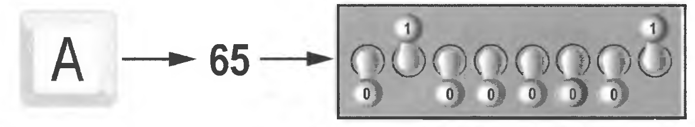

### Строковые типы данных

**Строка** — это тип данных, предназначенный для работы с текстом. Чтобы создать строку в Python, нужно использовать
одинарные или двойные кавычки. Для многострочных строк можно использовать тройные кавычки (тоже одинарные или двойные).

```python
short_sentence = 'Hello, nice to meet you'
longer_sentence = "Hello, I am really pleased to see you here"
longest_sentence = """Hello, hello, hello
absolutely please to come by
and wonder how you happen to be here?
"""
```

Было бы довольно скучно, если все строки в программе можно было бы создавать только в исходном коде. К счастью, в
Python есть такая функция, как input. С ее помощью можно получить строку от пользователя.

```python
name = input('Enter your name: ')
greeting = f"Hello, {name}!"
print(greeting)
```

Строки могут быть пустыми, то есть не иметь внутри себя ни одного символа. Пробел — это такой же символ, как и все
остальные и эти две строки не равны.

```python
a = ""  # empty string
b = " "  # string containing a space
```

## Виды строк

`r''` — сырые строки. Подавляют экранирование.

`b'' `— строки битов.

`f'{x}'` — форматированные строки (f-строки), где х - это переменная.

Форматирование строк обсудим дальше.

## Базовые операции

```python
# Конкатенация (сложение)
word1 = 'spam'
word2 = 'eggs'
print(word1 + word2)
'spameggs'

# Дублирование строки
print('spam' * 3)
spamspamspam

# Длина строки
len('spam')
4

# Доступ по индексу
word = 'spam'
word[0]
's'
word[2]
'a'
word[-2]
'a'

# Срез
word = 'spameggs'

word[3:5]
'me'

word[2:-2]
'ameg'

word[:6]
'spameg'

word[1:]
'pameggs'

word[:]
'spameggs'

# Шаг, извлечения среза
word[::-1]
'sggemaps'

word[3:5:-1]
''

word[2::2]
'aeg'
```

## Срезы

Срез (slice) — извлечение из данной строки одного символа или некоторого фрагмента подстроки или подпоследовательности.

Есть три формы срезов. Самая простая форма среза: взятие одного символа строки, а именно, S[i] — это срез, состоящий из
одного символа, который имеет номер i. При этом считается, что нумерация начинается с числа 0. То есть если S = 'Hello',
то S[0] == 'H', S[1] == 'e', S[2] == 'l', S[3] == 'l', S[4] == 'o'.

Заметим, что в Питоне нет отдельного типа для символов строки. Каждый объект, который получается в результате среза
S[i] — это тоже строка типа str.
Номера символов в строке (а также в других структурах данных: списках, кортежах) называются _индексом_.

Если указать отрицательное значение индекса, то номер будет отсчитываться с конца, начиная с номера -1. То есть
S[-1] == 'o', S[-2] == 'l', S[-3] == 'l', S[-4] == 'e', S[-5] == 'H'.

Если же номер символа в срезе строки S больше либо равен len(S), или меньше, чем -len(S), то при обращении к этому
символу строки произойдет ошибка IndexError: string index out of range.

Срез с двумя параметрами: S[a:b] возвращает подстроку из b - a символов, начиная с символа c индексом a, то есть до
символа с индексом b, не включая его. Например, S[1:4] == 'ell', то же самое получится если написать S[-4:-1]. Можно
использовать как положительные, так и отрицательные индексы в одном срезе, например, S[1:-1] — это строка без первого и
последнего символа (срез начинается с символа с индексом 1 и заканчивается индексом -1, не включая его).

При использовании такой формы среза ошибки IndexError никогда не возникает. Например, срез S[1:5] вернет строку 'ello',
таким же будет результат, если сделать второй индекс очень большим, например, S[1:100] (если в строке не более
100 символов).

Если опустить второй параметр (но поставить двоеточие), то срез берется до конца строки. Например, чтобы удалить из
строки первый символ (его индекс равен 0), можно взять срез S[1:]. Аналогично если опустить первый параметр, то можно
взять срез от начала строки. То есть удалить из строки последний символ можно при помощи среза S[:-1]. Срез S[:]
совпадает с самой строкой S.

Любые операции среза со строкой создают новые строки и никогда не меняют исходную строку. В Питоне строки вообще
являются неизменяемыми, их невозможно изменить. Можно лишь в старую переменную присвоить новую строку.

На самом деле в питоне нет и переменных. Есть лишь имена, которые связаны с какими-нибудь объектами. Можно сначала
связать имя с одним объектом, а потом — с другим. Можно несколько имён связать с одним и тем же объектом.

Если задать срез с тремя параметрами S[a:b:d], то третий параметр задает шаг, как в случае с функцией range, то есть
будут взяты символы с индексами a, a + d, a + 2 * d и т. д. При задании значения третьего параметра, равному 2, в срез
попадет каждый второй символ, а если взять значение среза, равное -1, то символы будут идти в обратном порядке.
Например, можно перевернуть строку срезом S[::-1].

## Другие функции и методы строк

Методы строк

| Метод                                | Назначение                                                                                                  |
|--------------------------------------|-------------------------------------------------------------------------------------------------------------|
| s.capitalize()                       | переводит первую букву в верхний, а остальные в нижний регистр.                                             |
| s.casefold()                         | переводит все символы в нижний регистр                                                                      |
| s.center(width[, fillvalue])         | обрамляет значениями fillvalue строку, пока длина не станет width                                           |
| s.count(str[, start][, end]          | считает количество подстрок str в выбранном промежутке строки                                               |
| s.encode(encoding, errors)           | меняет кодировку строки                                                                                     |
| s.endswith(suffix[, start][, end])   | возвращает True если строка заканчивается на suffix, иначе False                                            |
| s.expandtabs(tabsize=8)              | увеличивает размер символов табуляции до tabsize пробелов                                                   |
| s.find(str[, start][, end])          | возвращает индекс начала первой подстроки str в выбранном промежутке или -1, если она не найдена            |
| s.format(args, *kwargs)              | последовательно заменяет {} в строке на свои аргументы                                                      |
| s.format_map(dict)                   | заменяет {<val>} в строке на dict[<val>]                                                                    |
| s.index(str[, start][, end])         | возвращает индекс начала первой подстроки str в выбранном промежутке или ValueError, если она не найдена    |
| s.isalnum()                          | возвращает True, если строка состоит только из букв и цифр, иначе False                                     |
| s.isalpha()                          | возвращает True, если строка состоит только из букв, иначе False                                            |
| s.isdecimal()                        | возвращает True, если строка состоит только из цифр, иначе False [1]                                        |
| s.isdigit()                          | возвращает True, если строка состоит только из цифр, иначе False [1]                                        |
| s.isidentifier()                     | возвращает True, если строка является идентификатором (if, class, assert), иначе False                      |
| s.islower()                          | возвращает True, если вся строка в нижнем регистре, иначе False                                             |
| s.isnumeric()                        | возвращает True, если строка состоит только из цифр, иначе False [1]                                        |
| s.isprintable()                      | возвращает True, если все символы строки отображаются, иначе False (например, \n, \t)                       |
| s.isspace()                          | возвращает True, если строка состоит из пробелов, иначе False                                               |
| s.istitle()                          | возвращает True, если строка начинается с заглавной буквы, а остальные — строчные, иначе False              |
| s.isupper()                          | возвращает True, если строка в верхнем регистре, иначе False                                                |
| s.join(iter)                         | склеивает элементы последовательности iter в одну строку с разделителем s                                   |
| s.ljust(width, fillchar=' ')         | добавляет в конец строки символ fillchar, пока длина не станет width                                        |
| s.lower()                            | переводит символы строки в нижний регистр                                                                   |
| s.lstrip([chars])                    | возвращает строку без пробельных символов или chars в начале                                                |
| s.maketrans(*args)                   | возвращает таблицу перевода для s.translate                                                                 |
| s.partition(sep)                     | разделяет строку на три части по первому разделителю sep: [начало, sep, конец]                              |
| s.replace(old, new)                  | заменяет все подстроки old на new                                                                           |
| s.rfind(str[, start][, end])         | возвращает индекс начала последней подстроки str в выбранном промежутке или -1, если она не найдена         |
| s.rindex(str[, start][, end])        | возвращает индекс начала последней подстроки str в выбранном промежутке или ValueError, если она не найдена |
| s.rjust(width, fillchar=' ')         | добавляет в начало строки символ fillchar, пока длина не станет width                                       |
| s.rpartition()                       | разделяет строку на три части по последнему разделителю sep: [начало, sep, конец]                           |
| s.rsplit(sep=' ', maxsplit=-1)       | возвращает список подстрок, разделенных по sep до maxsplit раз (с конца)                                    |
| s.rstrip([chars])                    | возвращает строку без пробельных символов или chars в конце                                                 |
| s.split((sep=' ', maxsplit=-1))      | возвращает список подстрок, разделенных по sep до maxsplit раз                                              |
| s.splitlines(keepends=False)         | Разделяет строку по \n. Не удаляет разделители, если keepends=True.                                         |
| s.startswith(prefix[, start][, end]) | возвращает True если строка начинается с prefix, иначе False                                                |
| s.strip([chars])                     | возвращает строку без пробельных символов или chars в начале и конце                                        |
| s.swapcase()                         | меняет регистр всех символов на противоположный                                                             |
| s.title()                            | возвращает строку, где все слова начинаются с заглавной буквы, а продолжаются строчными                     |
| s.translate(table)                   | заменяет все символы строки согласно таблице перевода                                                       |
| s.upper()                            | возвращает копию строки в верхнем регистре                                                                  |
| s.zfill(width)                       | Заполняет строку указанным числом нулей в начале                                                            |

Хорошая новость в том, что вам не нужно запоминать или учить все эти методы и их синтаксис. Но вам нужно помнить о
замечательных функциях `dir` и `help`.

`dir(<type>)` возвращает все магические и немагические методы, доступные для типа данных.

```python
>> > dir(str)
  ['__add__', '__class__', '__contains__', '__delattr__', '__dir__', '__doc__', '__eq__', '__format__', '__ge__',
   '__getattribute__', '__getitem__', '__getnewargs__', '__getstate__', '__gt__', '__hash__', '__init__',
   '__init_subclass__', '__iter__', '__le__', '__len__', '__lt__', '__mod__', '__mul__', '__ne__', '__new__',
   '__reduce__', '__reduce_ex__', '__repr__', '__rmod__', '__rmul__', '__setattr__', '__sizeof__', '__str__',
   '__subclasshook__', 'capitalize', 'casefold', 'center', 'count', 'encode', 'endswith', 'expandtabs', 'find', 'format',
   'format_map', 'index', 'isalnum', 'isalpha', 'isascii', 'isdecimal', 'isdigit', 'isidentifier', 'islower', 'isnumeric',
   'isprintable', 'isspace', 'istitle', 'isupper', 'join', 'ljust', 'lower', 'lstrip', 'maketrans', 'partition',
   'removeprefix', 'removesuffix', 'replace', 'rfind', 'rindex', 'rjust', 'rpartition', 'rsplit', 'rstrip', 'split',
   'splitlines', 'startswith', 'strip', 'swapcase', 'title', 'translate', 'upper', 'zfill']

```

`help(<type>.<method_name>)` возвращает синтаксис и описание работы метода. Документация Python всегда рядом,
пользуйтесь)

```python
help(str.find)
Help on method_descriptor:
find(...)
    S.find(sub[, start[, end]]) -> int
    
    Return the lowest index in S where substring sub is found,
    such that sub is contained within S[start:end].  Optional
    arguments start and end are interpreted as in slice notation.
    
    Return -1 on failure.
```

# s.find(substring)

Метод `find `находит в данной строке (к которой применяется метод) данную подстроку (которая передается в качестве
параметра). Функция возвращает индекс первого вхождения искомой подстроки. Если же подстрока не найдена, то метод
возвращает значение -1.

Если вызвать метод find с тремя параметрами `S.find(T, a, b)`, то поиск будет осуществляться в срезе `S[a:b]`. Если
указать только два параметра `S.find(T, a)`, то поиск будет осуществляться в срезе `S[a:]`, то есть начиная с символа
с индексом `a` и до конца строки. Метод `S.find(T, a, b)` возвращает индекс в строке S, а не индекс относительно среза.

# s.rfind(substring)

Аналогично, метод `rfind` возвращает индекс последнего вхождения данной строки (“поиск справа”).

# s.replace(old, new)

Метод `replace` заменяет все вхождения одной строки на другую. Формат: `S.replace(old, new)` — заменить в строке S все
вхождения подстроки old на подстроку new.

Если методу replace задать еще один параметр: S.replace(old, new, count), то заменены будут не все вхождения, а
только не больше, чем первые count из них.

```python
# Литералы строк
S = 'str';
S = "str";
S = '''str''';
S = """str"""

# Экранированные последовательности
S = "s\np\ta\nbbb"

# Неформатированные строки (подавляют экранирование)
S = r"C:\temp\new"

# Строка байтов
S = b"byte"

# Конкатенация (сложение строк)
S1 + S2

# Повторение строки
S1 * 3

# Обращение по индексу
S[i]

# Извлечение среза
S[i:j:step]

# Длина строки
len(S)

# Поиск подстроки в строке. Возвращает номер первого вхождения или -1
S.find(str, [start], [end])

# Поиск подстроки в строке. Возвращает номер последнего вхождения или -1
S.rfind(str, [start], [end])

# Поиск подстроки в строке. Возвращает номер первого вхождения или вызывает ValueError
S.index(str, [start], [end])

# Поиск подстроки в строке. Возвращает номер последнего вхождения или вызывает ValueError
S.rindex(str, [start], [end])

# Замена шаблона
S.replace(шаблон, замена)

# Разбиение строки по разделителю
S.split(символ)

# Состоит ли строка из цифр
S.isdigit()

# Состоит ли строка из букв
S.isalpha()

# Состоит ли строка из цифр или букв
S.isalnum()

# Состоит ли строка из символов в нижнем регистре
S.islower()

# Состоит ли строка из символов в верхнем регистре
S.isupper()

# Состоит ли строка из неотображаемых символов (пробел, символ перевода страницы ('\f'), "новая строка" ('\n'), "перевод каретки" ('\r'), "горизонтальная табуляция" ('\t') и "вертикальная табуляция" ('\v'))
S.isspace()

# Начинаются ли слова в строке с заглавной буквы
S.istitle()

# Преобразование строки к верхнему регистру
S.upper()

# Преобразование строки к нижнему регистру
S.lower()

# Начинается ли строка S с шаблона str
S.startswith(str)

# Заканчивается ли строка S шаблоном str
S.endswith(str)

# Сборка строки из списка с разделителем S
S.join(список)

# Символ в его код ASCII
ord(символ)

# Код ASCII в символ
chr(число)

# Переводит первый символ строки в верхний регистр, а все остальные в нижний
S.capitalize()

# Возвращает отцентрованную строку, по краям которой стоит символ fill (пробел по умолчанию)
S.center(width, [fill])

# Возвращает количество непересекающихся вхождений подстроки в диапазоне [начало, конец] (0 и длина строки по умолчанию)
S.count(str, [start], [end])

# Возвращает копию строки, в которой все символы табуляции заменяются одним или несколькими пробелами, в зависимости от текущего столбца. Если TabSize не указан, размер табуляции полагается равным 8 пробелам
S.expandtabs([tabsize])

# Удаление пробельных символов в начале строки
S.lstrip([chars])

# Удаление пробельных символов в конце строки
S.rstrip([chars])

# Удаление пробельных символов в начале и в конце строки
S.strip([chars])

# Возвращает кортеж, содержащий часть перед первым шаблоном, сам шаблон, и часть после шаблона. Если шаблон не найден, возвращается кортеж, содержащий саму строку, а затем две пустых строки
S.partition(шаблон)

# Возвращает кортеж, содержащий часть перед последним шаблоном, сам шаблон, и часть после шаблона. Если шаблон не найден, возвращается кортеж, содержащий две пустых строки, а затем саму строку
S.rpartition(sep)

# Переводит символы нижнего регистра в верхний, а верхнего – в нижний
S.swapcase()

# Первую букву каждого слова переводит в верхний регистр, а все остальные в нижний
S.title()

# Делает длину строки не меньшей width, по необходимости заполняя первые символы нулями
S.zfill(width)

# Делает длину строки не меньшей width, по необходимости заполняя последние символы символом fillchar
S.ljust(width, fillchar=" ")

# Делает длину строки не меньшей width, по необходимости заполняя первые символы символом fillchar
S.rjust(width, fillchar=" ")
```

## Интерполяция строк / f-строки

Python 3.6 Добавил новый подход форматирования строк под названием форматированные строчные литералы, или “f-строки”.
Этот новый способ форматирования строк позволяет вам использовать встроенные выражения Python внутрь строковых констант.
Вот простой, наглядный пример:

```python
name = 'Bob'
print(f'Hello, {name}!')
```

F-строки имеют ряд преимуществ перед оператором `%` и методом `.format()`, например:

- Более краткие и удобочитаемые: F-строки обычно более читабельны и лаконичны. Поскольку вы можете вставлять переменные
  и выражения непосредственно в строку, их легче понимать и поддерживать.

- Быстрее: F-строки также немного быстрее, чем оператор `%` и метод `.format()`. Эта эффективность становится более
  заметной в программах, работающих с большим количеством строк.

F-строки также имеют спецификатор `=`, который может помочь вам отладить код, отображая выражение и его результирующее
значение. Эта функция недоступна в других методах форматирования. Она присуща только f-строкам.

F-строки поддерживают [мини-язык спецификаций форматирования](https://docs.python.org/3/library/string.html#formatspec)
Python. Поэтому в модификаторы, используемые в f-строках,
можно внедрить множество операций форматирования данных:

```python
text = "hello world"

# Центрирование текста:
print(f"{text:^15}")
# '  hello world  '

number = 1234567890
# Установка разделителя групп разрядов
print(f"{number:,}")
# 1,234,567,890

number = 123
# Добавление начальных нулей
print(f"{number:08}")
# 00000123
```

Форматирование целых и вещественных чисел (int and float)

| Fill | Width | Grouping | Precision | Type | All Together | 	Example Output |
|------|-------|----------|-----------|------|--------------|-----------------|
|      |       |          | .2	       | f    | {num:.2f}    | '4125.60'       |
|      |       | ,        | .2	       | f    | {num:,.2f}   | '4,125.60'      |
| 0    | 8     |          | .2        | f    | {num:08.2f}  | '04125.60'      |
|      | 8     |          | .2        | f    | {num: 8.2f}	 | ' 4125.60'      |
|      |       |          | .0        | %    | {num:.0%}    | 	'50%'          |

Целые числа (int)

| Alt | Fill | Width | Grouping | Type | All Together | Example Output |
|-----|------|-------|----------|------|--------------|----------------|
|     | 0    | 2     |          | d    | {number:02d} | '09'           |
|     |      | 3     |          | d    | {number:3d}  | ' 9'           |
|     |      |       | ,        | d    | {number:,}   | '9'            |

Строки

| Fill Char | Align | Width | All Together | Example Output |
|-----------|-------|-------|--------------|----------------|
|           | >     | 15    | {string:>6}  | '  Trey'       |
|           | <     | 15    | {string:<6}  | 'Trey  '       |
|           | ^     | 15    | {string:^6}  | ' Trey '       |
| 0         | >     | 8     | {string:0>8} | '0000Trey'     |


Пример

```python
>>> costs = [1.10, 0.30, 0.40, 2]
>>> print(f"{sum(costs)=}")
sum(costs)=3.8000000000000003

# you can combine several options like calculating, specifying the variable and formatting the result
>>> print(f"{sum(costs)=:.2f}")
sum(costs)=3.80

# spaces around = operator are preserved
>>> print(f"{costs = }")
costs = [1.1, 0.3, 0.4, 2]
>>> print(f"{sum(costs) = :.2f}")
sum(costs) = 3.80
```

## Хранение символов

Любая порция данных в оперативной памяти компьютера должна храниться как двоичное число. Это относится и к символам,
таким как буквы и знаки препинания. Когда символ сохраняется в памяти, он сначала преобразуется в цифровой код. И затем
этот цифровой код сохраняется в памяти как двоичное число.

За прошедшие годы для представления символов в памяти компьютера были разработаны различные схемы кодирования.
Исторически самой важной из этих схем кодирования является схема кодирования ASCII (American Standard Code for
Information Interchange — американский стандартный код обмена информацией). ASCII представляет собой набор из 128
цифровых кодов, которые обозначают английские буквы, различные знаки препинания и другие символы. Например, код ASCII
для прописной английской буквы А (латинской) равняется 65. Когда на компьютерной клавиатуре вы набираете букву А в
верхнем регистре, в памяти сохраняется число 65 (как двоичное число, разумеется).



Набор символов ASCII был разработан в начале 1960-х годов и в конечном счете принят почти всеми производителями
компьютеров. Однако схема кодирования ASCII имеет ограничения, потому что она определяет коды только для 128 символов.
Для того чтобы это исправить, в начале 1990-х годов был разработан набор символов Юникода (Unicode). Это широкая схема
кодирования, совместимая с ASCII, которая может также представлять символы многих языков мира. Сегодня Юникод быстро
становится стандартным набором символов, используемым в компьютерной индустрии.
