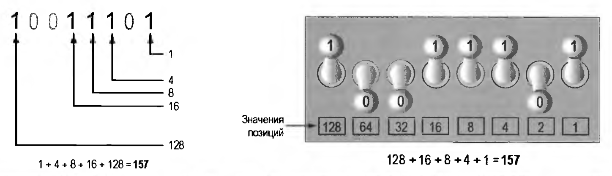

### Как компьютеры хранят данные?

Все хранящиеся в компьютере данные преобразуются в последовательности, состоящие из нулей и единиц.
Память компьютера разделена на единицы хранения, которые называются байтами. Одного байта памяти достаточно только для 
того, чтобы разместить одну букву алфавита или небольшое число. Для того чтобы делать что-то более содержательное, 
компьютер должен иметь очень много байтов. Большинство компьютеров сегодня имеет миллионы или даже миллиарды байтов 
оперативной памяти.

Каждый байт разделен на восемь меньших единиц хранения, которые называются битами, или разрядами. Термин "бит" 
происходит от англ. binary digit и переводится как двоичная цифра. Программисты обычно рассматривают биты, как 
крошечные переключатели, которые могут находиться в одном из двух положений: включено или выключено. Однако на самом 
деле биты не являются "переключателями", по крайней мере не в стандартном смысле. В большинстве компьютерных систем 
биты — это крошечные электрические компоненты, которые могут содержать либо положительный, либо отрицательный заряд. 
Программисты рассматривают положительный заряд, как переключатель в положении "Включено", и отрицательный заряд, как 
переключатель в положении "Выключено". 

На рисунке показано, как программист может рассматривать байт памяти: как коллекцию переключателей, каждый из которых 
установлен в положение "Вкл" либо "Выкл".

Когда порция данных сохраняется в байте, компьютер размещает восемь битов в двухпозиционной комбинации 
"включено-выключено", которая представляет данные. Например, на рисунке слева показано, как в байте будет размещено 
число 77, а справа — латинская буква А. Далее мы объясним, каким образом эти комбинации определяются.

## Хранение чисел

Бит используется для представления чисел в весьма ограниченной форме. В зависимости от того, "включен" он или 
"выключен", бит может представлять одно из двух разных значений. В компьютерных системах выключенный бит представляет 
число 0, а включенный — число 1. Это идеально соответствует двоичной системе исчисления, в которой все числовые значения
записываются как последовательности нулей и единиц. Вот пример числа, которое записано в двоичной системе исчисления
как 100111101

Позиция каждой цифры в двоичном числе соответствует определенному значению. Как показано на рисунке слева, начиная с 
самой правой цифры и двигаясь влево, значения позиций равняются 20, 21, 
22, 23 и т. д. На рисунке справа показана та 
же схема, но здесь позиции вычислены и равняются 1, 2, 4, 8 и т. д.

На рисунке слева показано, как можно изобразить хранение числа 157 в байте оперативной памяти. Каждая 1 представлена 
битом в положении "Вкл", а каждый 0 — битом в положении "Выкл".

Когда всем битам в байте назначены нули (т. е. они выключены), значение байта равняется 0. Когда всем битам в байте 
назначены единицы (т. е. они включены), байт содержит самое большое значение, которое в нем может быть размещено. 
Оно равняется 1 + 2 + 4 + 8 + 16 + + 32 + 64 + 128 = 255. Этот предел является следствием того, что в байте всего 
восемь бит. Если нужно хранить число, которое больше 255, используется еще один байт. В итоге получаем 16 бит.
Позиционные значения этих 16 бит будут от 20 до 215. Максимальное значение, которое можно
разместить в двух байтах, равно 65 535. Если же нужно сохранить еще большее число, для этого потребуется больше байтов.
