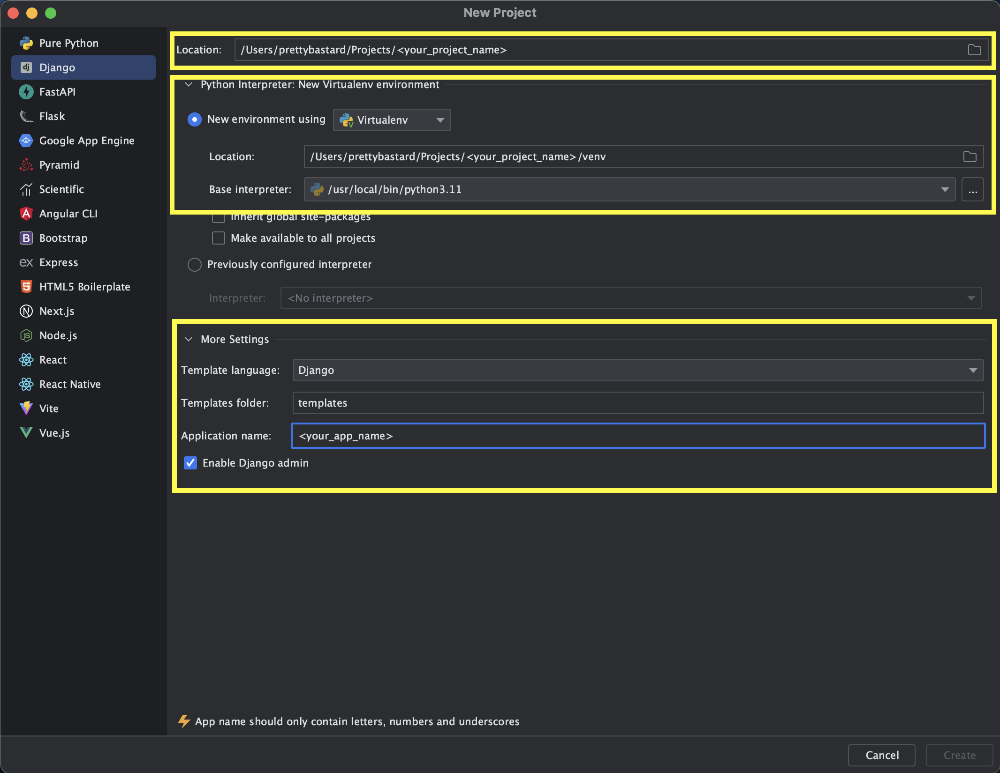
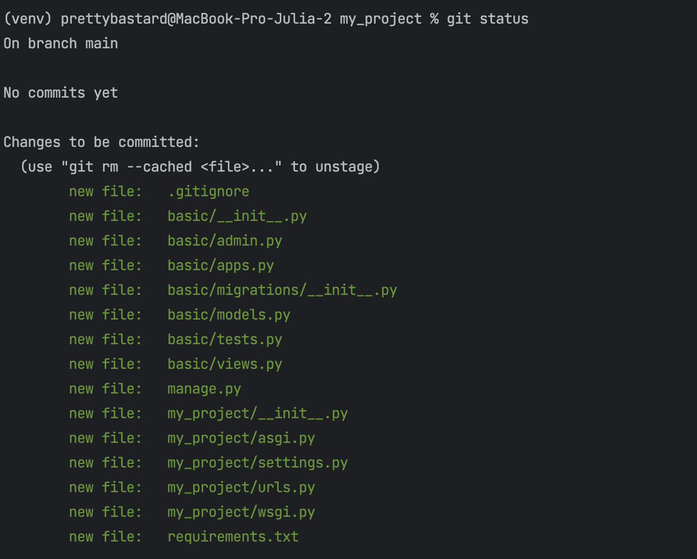
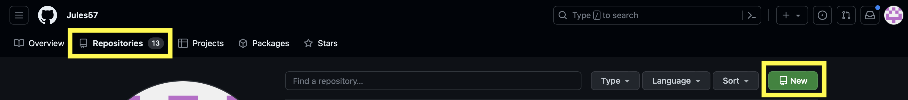
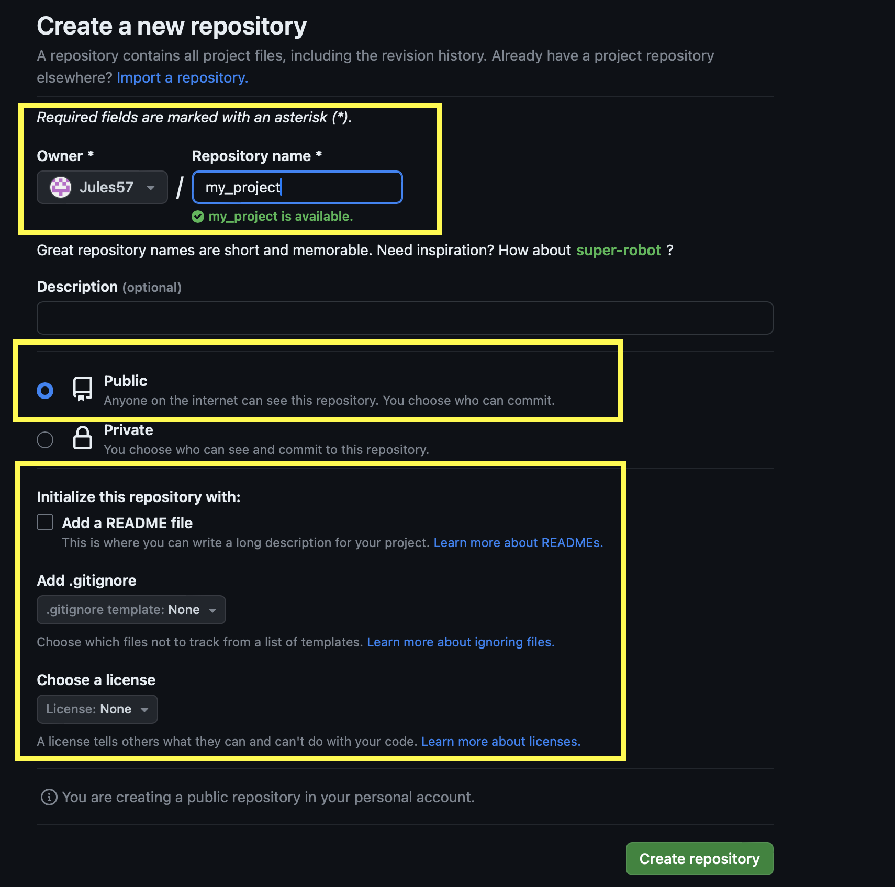
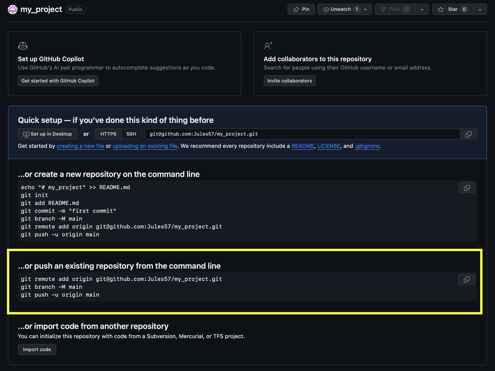
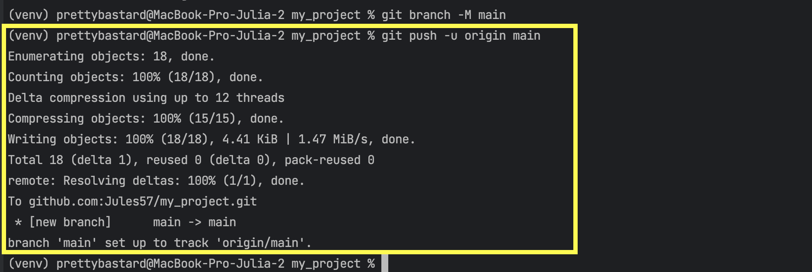

### Как создать новый Django проект в PyСharm Professional и настроить его для работы с Github

*Note.* Если вы пользуетесь PyCharm Community, то выберите любой удобный способ и установите PyCharm Professional.
Почему? Потому что Community Edition не поддерживает большую и важную часть функционала, который нам потребуется
в процессе обучения. Давайте сразу привыкать к удобному. 

## Шаг 1.

1. Создайте новый проект в PyCharm: `PyCharm > File > New Project`
2. Выберите тип проекта `Django` или `Pure Python`. 
3. Укажите путь к проекту и его название. 
4. Выберите виртуальное окружение для проекта, если вы используете pip. 
5. Выберите версию Python.

Опционально:

- Оставляем стандартный template language и templates folder (рекомендуется).
- Можно сразу указать имя приложения, и PyCharm вместе с проектом сразу создаст приложение.
- Оставляем галочку для админки.



Виртуальная среда у вас уже установлена, а также Django и его зависимости.

## Шаг 2.

Создайте файл requirements.txt: 

`pip freeze > requirements.txt`

Знак больше `>` перенаправляет вывод команды pip freeze из консоли в ваш файл.

Note: если вам нужно установить требования из файла requirements.txt, используйте команду:

`pip install -r requirements.txt`


## Шаг 3.

Создайте файл .gitignore. Базовый список того, что там может лежать:

```
*.log
*.pot
*.pyc
.idea/
venv/
__pycache__
db.sqlite3
media/
```

Очень подробный список всего, чего не должно быть в вашем репозитории, можно посмотреть 
[здесь](https://djangowaves.com/tips-tricks/gitignore-for-a-django-project/).


## Шаг 4.

Инициализируйте свой проект как git репозиторий:

`git init`

Проверьте файлы, которые должны быть проиндексированы:

`git status `

В вашем индексе должны быть .gitignore, requirements.txt, manage.py, <папка проекта> - у меня это my_project/, <папка приложения> - у меня это basic/


Если там что-то лишнее, добавьте его в .gitignore. Затем проиндексируйте файлы:

`git add`

Ваши файлы должны быть успешно добавлены в индекс:


Теперь вы можете создать первый коммит:

`git commit -m "initial commit"`

Отлично, теперь мы можем переходить к настройке проекта на GitHub.


## Шаг 6.

Перейдите на главную страницу в GitHub, откройте вкладку репозиторием и нажмите `New`:



У вас появится страница создания репозитория, укажите имя репозитория. Оно должно быть уникальным в рамках вашего 
списка репозиториев. Можете добавить описание, .gitignore файл мы уже создали, файл README.md 
можно добавить позже, лицензия для базовых проектов нам не нужна. Заполните и нажмите `Create`.




## Шаг 7.

Теперь нужно залить наш локальный проект в репозиторий на GitHub. Следуем инструкции GitHub:




Сначала связываем репозиторий на GitHub с нашим локальным проектом:

`git remote add origin git@github.com:<your_github_nickname>/<your_project_name>.git`

По умолчанию вы обращаетесь к вашему репозиторию на GitHub именно по SSH ключу. Предполагается, что вы уже 
сгенерировали себе пару приватного и публичного ключей.

GitHub предлагает переименовать вашу основную ветку в main и сделать ее главной для вашего проекта. То есть если ваша 
ветка называлась _master_, то она станет _main_. Если ваша ветка уже была _main_, то ничего не изменится.

`git branch -M main`
Заливаем наши изменения в удаленный репозиторий.

Флаг _-u_ обозначает _—set-upstream_, именно здесь мы связываем наш локальный проект с удаленным репозиторием, и потом 
все push/pull команды работают именно с ним.

_origin_ - наш удаленный репозиторий на GitHub (мы создали ее в шаге 12)

_main_ - ветка, которую мы заливаем

`git push -u origin main`

Вы должны получить примерно такое сообщение:



Поздравляю! Вы успешно настроили свой новый проект для работы с GitHub! 👌
